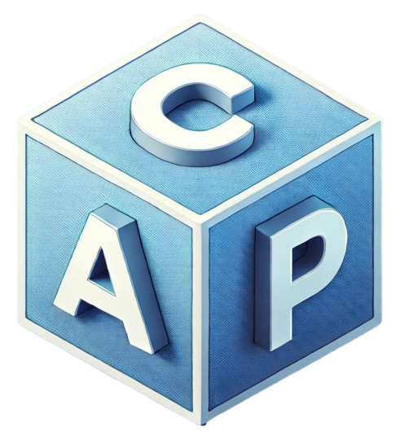

# cap-pie

<p align="center">
  
</p>

<p align="center">
  <b>CAP - Cardano Analytics Platform</b><br/>
  Piece of Pie Hackathon Repository<br/>
  LLM-Powered Analytics • Cardano Data • Payment-Gated Access
</p>

---

## Overview

`cap-pie` is the working repository used by **MOBR Systems** to register, integrate, and demonstrate our development work during the **Gimbalabs Piece of Pie Hackathon**.

CAP is the **Cardano Analytics Platform**, an LLM-powered analytics platform that helps users query and understand Cardano blockchain data through natural-language prompts, semantic data models, SPARQL queries, dashboards, and real-time insights.

During the Piece of Pie Hackathon, this repository is used to consolidate the backend and frontend work related to CAP’s productization path, especially features around:

* Cardano wallet authentication
* payment-gated access
* billing and entitlement logic
* admin controls
* user-facing frontend integration
* hackathon delivery tracking

The goal is to keep a transparent, inspectable repository that shows the evolution of CAP during the hackathon while still preserving the original backend and frontend repositories as the preferred development sources.

---

## Repository Structure

This repository is organized as a subtree-based integration repository.

```text
cap-pie/
├── backend/    # CAP backend subtree
├── frontend/   # CAP frontend subtree
└── README.md   # Hackathon repository overview
```

Each main folder maps to one of the original CAP repositories.

---

## Backend Subtree

The `backend/` folder contains the CAP backend subtree.

Original repository:

```text
git@github.com:mobr-ai/cap.git
```

The backend includes the FastAPI application, Cardano data pipelines, semantic query infrastructure, authentication, billing, admin endpoints, and related services.

For backend-specific setup, architecture, and development details, see:

```text
backend/README.md
```

To inspect backend history before subtree mapping:

```bash
git log ebef786 --
```

---

## Frontend Subtree

The `frontend/` folder contains the CAP frontend subtree.

Original repository:

```text
git@github.com:mobr-ai/cap-frontend.git
```

The frontend includes the React/Vite single-page application for CAP, including login flows, dashboards, user settings, wallet integration, billing UI, admin controls, and multilingual UX.

For frontend-specific setup, architecture, and development details, see:

```text
frontend/README.md
```

To inspect frontend history before subtree mapping:

```bash
git log 78e99db --
```

---

## Preferred Development Workflow

Our preferred workflow is to keep development centered on the original repositories:

* `mobr-ai/cap`
* `mobr-ai/cap-frontend`

The preferred branch for active CAP development is:

```text
dev-mobr01
```

Development may happen in either of these ways:

1. Direct commits to `dev-mobr01`, when appropriate for fast deployment or hackathon iteration.
2. Feature or fix branches merged into `dev-mobr01` through pull requests, when the change benefits from review or separation.

After changes are completed and validated in the original repositories, this `cap-pie` repository is updated by pulling those changes into the corresponding subtrees.

In short:

```text
cap / cap-frontend
        ↓
active development on dev-mobr01
        ↓
tested and deployed
        ↓
subtree updates into cap-pie
        ↓
hackathon delivery record
```

This keeps `cap-pie` focused as a hackathon integration and delivery repository, while avoiding duplicated development workflows across multiple codebases.

---

## Updating Subtrees

Use subtree updates to bring the latest backend and frontend work into this repository.

Example backend update:

```bash
git subtree pull --prefix=backend git@github.com:mobr-ai/cap.git dev-mobr01 --squash
```

Example frontend update:

```bash
git subtree pull --prefix=frontend git@github.com:mobr-ai/cap-frontend.git dev-mobr01 --squash
```

After updating one or both subtrees:

```bash
git status
git add .
git commit -m "Update CAP subtrees for Piece of Pie"
git push
```

---

## Hackathon Scope

For the Piece of Pie Hackathon, this repository tracks CAP’s progress toward a more product-ready analytics platform.

The main hackathon work includes:

* Cardano wallet signature authentication
* user identity and session integration
* payment-gated access flows
* balance, entitlement, and usage tracking
* billing notification controls
* admin interfaces for operational oversight
* backend endpoint protection and admin-only access
* frontend UX polish for the payment and access flows
* deployment-ready integration between backend and frontend

The broader objective is to demonstrate how CAP can evolve from a research and analytics platform into a usable Web3 SaaS product for Cardano data intelligence.

---

## What is CAP?

CAP, the **Cardano Analytics Platform**, leverages LLMs, semantic data models, and analytics mechanisms to simplify Cardano data analysis.

CAP enables users to ask natural-language questions about Cardano activity and receive structured insights through:

* natural-language to query translation
* SPARQL and semantic knowledge graph support
* Cardano blockchain data synchronization
* dashboards and visual artifacts
* authenticated user sessions
* wallet-aware Web3 UX
* multilingual support

CAP is part of MOBR Systems’ broader effort to build AI-powered analytics infrastructure for Web3 ecosystems.

---

## Running the Project

Because this repository contains two subtree-based applications, setup instructions are maintained in each respective subtree.

Backend:

```text
backend/README.md
```

Frontend:

```text
frontend/README.md
```

Typical local development requires running the backend API and frontend SPA separately, following the instructions from each original project.

---

## Related Repositories

* CAP Backend
  `git@github.com:mobr-ai/cap.git`

* CAP Frontend
  `git@github.com:mobr-ai/cap-frontend.git`

* CAP Piece of Pie Hackathon Repository
  `git@github.com:mobr-ai/cap-pie.git`

---

## About MOBR Systems

MOBR Systems is a research-and-engineering-driven company building AI-powered and Web3-native platforms, with a focus on blockchain analytics, knowledge graphs, decentralized applications, and data-intensive systems.

CAP is one of MOBR Systems’ core analytics initiatives and contributes to the broader MoonDash vision for multi-chain, AI-powered blockchain intelligence.

---

## License

This repository follows the licensing terms of the original CAP backend and CAP frontend repositories.

See the corresponding license files and README files inside each subtree for more details.
