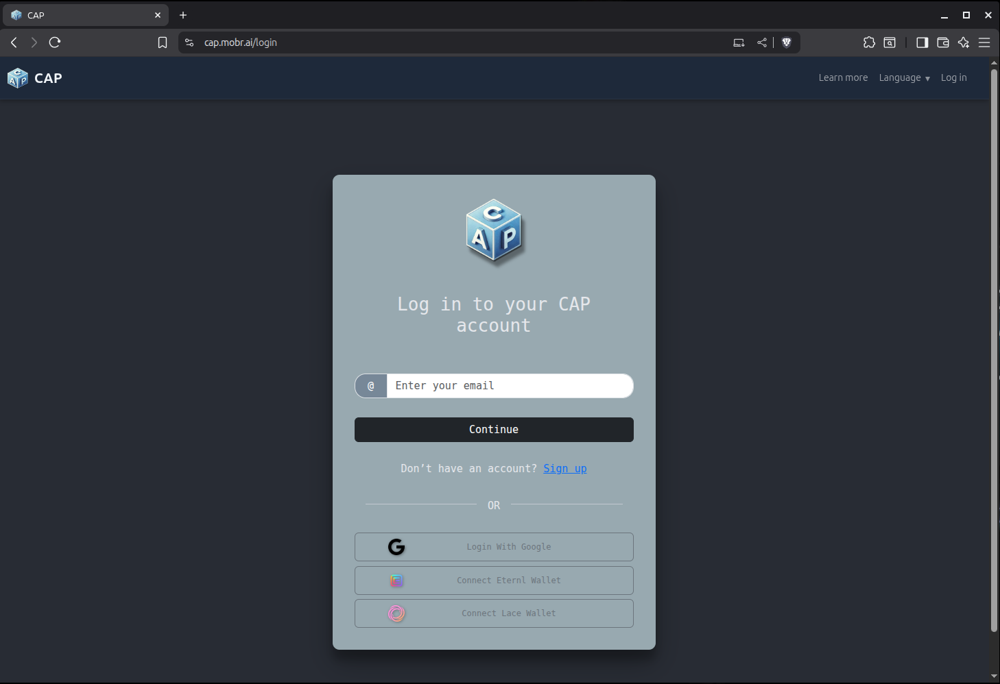
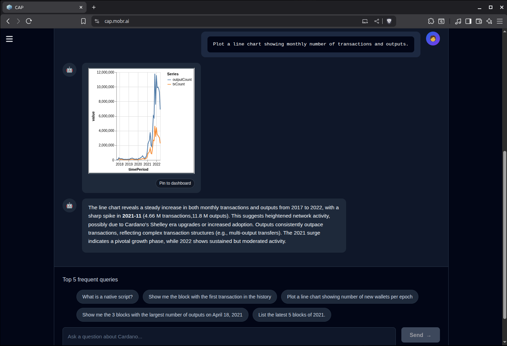
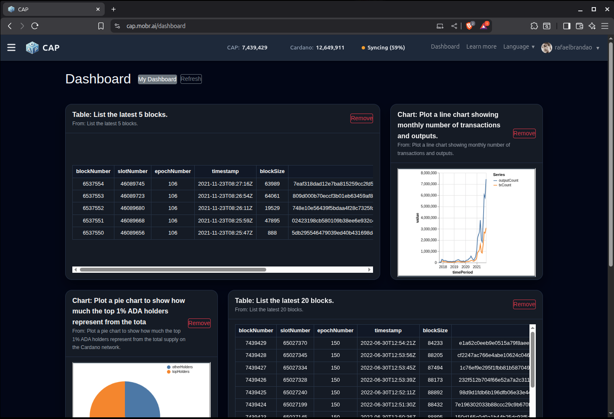
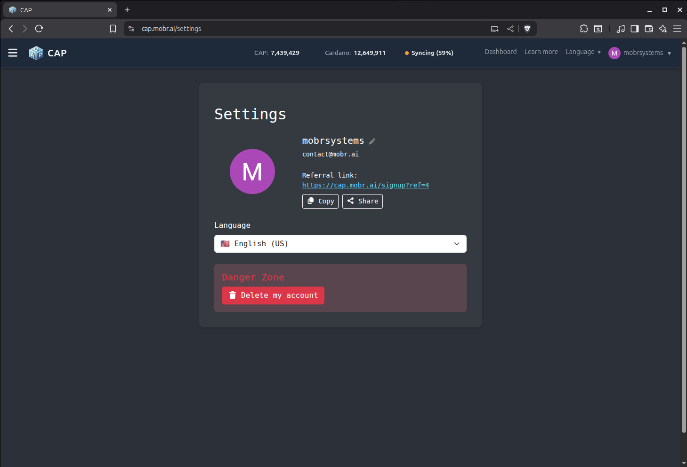

# CAP Frontend

**cap-frontend** is the **React/Vite single-page application (SPA)** for the
**[Cardano Analytics Platform (CAP)](https://github.com/mobr-ai/cap)** — an AI-powered blockchain analytics environment backed by
a semantic knowledge graph (RDF + SPARQL) and real-time Cardano data pipelines.

CAP Frontend provides the entire end-user interface for natural-language analytics, dashboards, interactive charts, Cardano wallet integrations, and multi-language UX.

<table align="center" style="border-collapse: collapse; border: none;">
  <tr style="border: none;">
    <td style="border: none; padding: 10px;">
      
    </td>
    <td style="border: none; padding: 10px;">
      
    </td>
  </tr>
  <tr style="border: none;">
    <td style="border: none; padding: 10px;">
      
    </td>
    <td style="border: none; padding: 10px;">
      
    </td>
  </tr>
</table>

<br>

---

## ✨ Key Capabilities

### 🔍 Natural Language Analytics

- NL → SPARQL → Results pipeline
- Real-time streaming responses (token-level)
- Automatic chart/table detection (`kv_results`)
- Contextual messages ("Fetching data...", "Analyzing...")

### 📊 Dashboards & Artifacts

- Pin any query result (table or chart) to your dashboard
- Interactive grid (drag, resize, remove widgets)
- Vega-Lite charts (`VegaChart`)
- Smart tables with automatic formatting (`KVTable`)
- Consistent artifact specification via `kvToChartSpec`

### 👤 Authentication & Identity

- Email/password auth (with confirmation flow)
- Google OAuth login
- Cardano CIP-30 wallet login
- Shared auth context across all pages
- Secure API interaction with session tokens

### 🔗 Cardano Wallet Publishing

- CIP-30 signing flows
- Topic publishing integration (DFCT compatibility)
- On-chain metadata linking
- Wallet balance checks (ADA + tokens)
- Transaction status tooltips and UI feedback

### 🌐 Multilingual UX

- Full **i18n** support (EN + PT-BR by default)
- Hot-swappable languages
- All features translated consistently

### 📡 System Monitoring

- Live ETL sync status (Cardano height vs CAP height)
- Auto-polling intervals with in-flight protection
- Health indicators

### 🧭 Navigation & Layout

- Responsive header + sidebar
- Mobile-first layout for NL queries, dashboards, and charts
- Styled toast notifications with click-to-open (dashboard deep link)

---

## 📁 Project Structure

```
cap-frontend/
├── public/                  # Static assets
├── src/
│   ├── components/          # UI primitives, artifacts, navigation, charts
│   │   ├── artifacts/
│   │   │   ├── VegaChart.jsx
│   │   │   ├── KVTable.jsx
│   │   │   └── [...]
│   │   ├── dashboard/
│   │   ├── layout/
│   │   └── [...]
│   ├── hooks/               # Custom hooks (auth, dashboard, syncStatus)
│   ├── i18n/                # Translations
│   ├── pages/               # High-level pages (Landing, Dashboard, Settings)
│   ├── styles/              # Global + modular CSS
│   ├── utils/               # Helpers (stream sanitizers, chart builders)
│   ├── index.jsx            # App entry with providers + routing
│   └── App.jsx
├── .env.example             # Template environment configuration
├── package.json
├── vite.config.js
└── README.md
```

---

## ⚙️ Environment Variables (Vite)

Vite loads environment variables automatically depending on the mode:

| File               | When It Loads           | Purpose                                     |
| ------------------ | ----------------------- | ------------------------------------------- |
| `.env`             | Always                  | Baseline defaults for all modes             |
| `.env.local`       | Always (ignored by Git) | Local machine overrides (tokens, endpoints) |
| `.env.development` | `npm run dev`           | Dev-mode overrides                          |
| `.env.production`  | `npm run build`         | Production build settings                   |

Example:

```
VITE_API_URL=http://localhost:8000/api
VITE_NL_ENDPOINT=http://localhost:8000/query
VITE_GOOGLE_CLIENT_ID=xxxx.apps.googleusercontent.com
VITE_ENV_LABEL=DEV
```

---

## 🚀 Getting Started

### Prerequisites

- **Node.js ≥ 18**
- npm or yarn

### Installation

```bash
git clone https://github.com/mobr-ai/cap-frontend.git
cd cap-frontend

cp .env.example .env.local   # optional, configure your own endpoints

npm install
npm run dev
```

The app will be running at:

```
http://localhost:5173
```

---

## 🏗️ Building for Production

```bash
npm run build
```

This generates a static bundle in:

```
dist/
```

When deployed inside the CAP backend, the backend serves the SPA from:

```
cap/src/cap/static/
```

(using Uvicorn/FastAPI).

---

## 🔗 Related Repos

- **[CAP Backend](https://github.com/mobr-ai/cap)**
  FastAPI, QLever triplestore and graph db, ETL pipelines.

- **CAP Ontology**
  Part of the backend repo under
  `src/ontologies/`—OWL/RDFS definitions for the Cardano KG.

---

## 🛠️ Tech Stack

- **React + Vite** — modern SPA tooling
- **React Router** — dynamic routing
- **React Bootstrap** — styled UI components
- **Vega-Lite & vega-embed** — chart rendering
- **i18next** — multilingual support
- **FastAPI backend** — REST endpoints for NL queries, dashboards, auth
- **Cardano CIP-30** — wallet integration (Eternl, Flint, Lace, etc.)

---

## 🤝 Contributing

Contributions are welcome!
Bug fixes, UI/UX polish, and improvements to queries & artifacts are especially appreciated.

---

## 📜 License

Licensed under the **GNU GPLv3**.
You may use, modify, and distribute the software under the same license.
